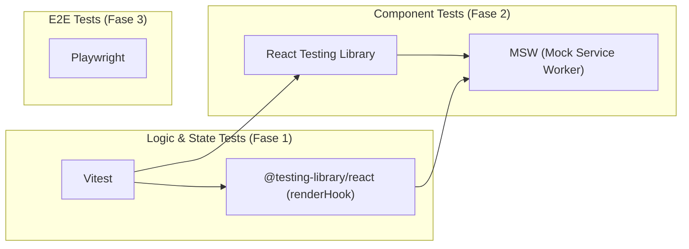

# Estrategia de Testing para AlTech Frontend (Post-Refactor)

## Análisis del Frontend

### Stack actual
| Aspecto | Tecnología |
|---|---|
| Framework | React 19.2.4 |
| Build | Vite 6.3.5 |
| Lenguaje | TypeScript 5.8.3 (strict) |
| CSS | Tailwind v4.2.2 + index.css |
| Estado | Zustand v5 (múltiples stores) |
| Routing | Ninguno (SPA single-screen) |
| UI Library | Ninguna (todo custom) |
| Layouts | react-resizable-panels |
| API Client | Fetch nativo modularizado en `services/` |

### Inventario de Arquitectura (Refactorizada)

| Módulo / Carpeta | Responsabilidad | Nivel de Riesgo |
|---|---|---|
| `src/store/` | Gestión de estado global (Zustand). Contiene lógica crítica de negocio: medición, calibración, canvas, app state, data. | 🔴 Crítico |
| `src/hooks/` | Reglas de negocio y flujos que orquestan API calls y mutations (`useFileManagerApi`, `useFileManagerLogic`, `useWebSocketSync`). | 🔴 Crítico |
| `src/services/` | Capa de abstracción de red (separada por dominio: `auth.service`, `micrographs.service`, etc.). | 🟡 Alto |
| `src/components/FileManager/` | UI compleja dividida en subcomponentes (`GalleryPanel`, `EditorHeader`, `NavControls`, etc.). | 🟡 Medio |
| `src/components/` | Componentes de raíz y modales (`FileManager.tsx`, `Sidebar.tsx`, `ChatPanel.tsx`, `LoginScreen.tsx`). | 🟡 Medio |

### Zonas de mayor riesgo de bugs (por orden de prioridad)

1. **Hooks de Lógica (`src/hooks/*`) y Stores de Zustand (`src/store/*`)** — El estado y la lógica de negocio se movieron aquí. La orquestación del FileManager, la sincronización WebSocket, la calibración y el manejo de data ahora residen en estas capas. **Aquí es donde se validarán las reglas de negocio más críticas.**
2. **Servicios de Red (`src/services/*`)** — El sistema de retry/recovery para HF Spaces, manejo de tokens y peticiones HTTP.
3. **Componentes con estado complejo UI (`ChatPanel.tsx`, `Canvas / Modals`)** — Interacciones de usuario, renderizado condicional dependiente de datos.

---

## Recomendación de Herramientas

> [!IMPORTANT]
> La recomendación está adaptada a tu nueva arquitectura, incorporando la necesidad de testear hooks y stores de Zustand, y reforzando el uso de MSW en lugar de mockeos manuales.

### Stack de testing recomendado

### ✅ Vitest — Test runner principal (Ya implementado)
Excelente decisión de mantenerlo. Comparte el pipeline con Vite y es rapidísimo para la nueva arquitectura modular.

### ✅ React Testing Library (RTL) — Testing de componentes y hooks
Imprescindible para testear la UI tal como la usan los usuarios y para probar los nuevos custom hooks (`renderHook`).

### ⚠️ MSW (Mock Service Worker) — Mockeo de API (Pendiente)
**Falta implementar.** Actualmente (en tests como `api.masks.test.ts`), estás mockeando `fetch` manualmente (`vi.fn()`). MSW intercepta a nivel de red, permitiendo simular el backend sin ensuciar la lógica ni mockear módulos nativos. Es mucho más robusto para probar tus `services` y la integración con la UI.

### ✅ Zustand Testing — Testeo de Stores
Testear stores de Zustand con Vitest es muy sencillo e independiente de React. Solo necesitas resetear el estado en el `beforeEach` para evitar filtraciones entre tests.

---

## Plan de Implementación (80%+ Cobertura)

### Fase 1: Consolidación de Infraestructura y MSW

#### 1.1 Configurar MSW
- Instalar `msw` en devDependencies.
- Crear `src/tests/mocks/handlers.ts` con las respuestas simuladas (endpoints de auth, materiales, máscaras, HF).
- Crear `src/tests/mocks/server.ts` y modificar `src/setupTests.ts` para levantar el server antes de los tests y resetear handlers.
- **Beneficio:** Permite eliminar el mockeo manual de `fetch`.

#### 1.2 Configurar entorno para Zustand
- Añadir un helper en `src/tests/utils/` para crear stores aislados o resetear los stores globales antes de cada test.

---

### Fase 2: Capa de Estado y Lógica (Máximo Valor / Ejecución Rápida)

> [!TIP]
> Testear los stores y los custom hooks ahora es mucho más fácil que testear el antiguo `FileManager` de 6600 líneas. Empezar por aquí subirá tu cobertura rápidamente.

#### 2.1 Testear Stores (`src/store/__tests__/`)
- `useAppStore.test.ts`: Toggles, modos (view/edit/measure).
- `useDataStore.test.ts`: Carga de datos de la jerarquía (Material -> Muestra -> Región).
- `useCalibrationStore.test.ts`: Lógica matemática y guardado de factor de píxeles.

#### 2.2 Testear Hooks (`src/hooks/__tests__/`)
- `useFileManagerLogic.test.ts`: Asegurar que el cambio de selección limpia los estados derivados correspondientes.
- `useWebSocketSync.test.ts`: Probar la conexión, reconexión y dispatch de eventos al recibir mensajes.

---

### Fase 3: Capa de Servicios

#### 3.1 Refactor de tests actuales (`src/services/`)
- Migrar `api.masks.test.ts` y otros tests existentes para que usen MSW en lugar de `mockFetch = vi.fn()`.
- Testear `apiClient.ts` (interceptores de token, refresco o redirección a login en caso de 401).
- Testear `auth.service.ts` y la correcta manipulación del `localStorage`.

---

### Fase 4: Tests de Componentes (Integración y UI)

#### 4.1 Componentes Modulares de FileManager (`src/components/FileManager/__tests__/`)
Dado que `FileManager` se dividió, testear cada subcomponente es viable:
- `NavControls.test.tsx`: Deshabilita/habilita botones según el estado.
- `GalleryPanel.test.tsx`: Renderiza las imágenes y responde a clics.
- `AdminPanel.test.tsx`: Controles de creación/edición.

#### 4.2 Componentes Core (`src/components/__tests__/`)
- `LoginScreen.test.tsx`: Integrado con MSW para simular error 401, error 403, y login exitoso.
- `ChatPanel.test.tsx`: Renderizado de markdown y envío de mensajes (mockeando el agent-api con MSW).
- `Sidebar.test.tsx`: Navegación y modales.

---

### Fase 5 (Futura): E2E con Playwright

Cuando la cobertura unitaria y de integración alcance un porcentaje alto (~70-80%), incorporar Playwright para flujos críticos (Happy paths):
- Login → Navegar Jerarquía → Subir Imagen → Calibrar.
- Uso del chat de IA.